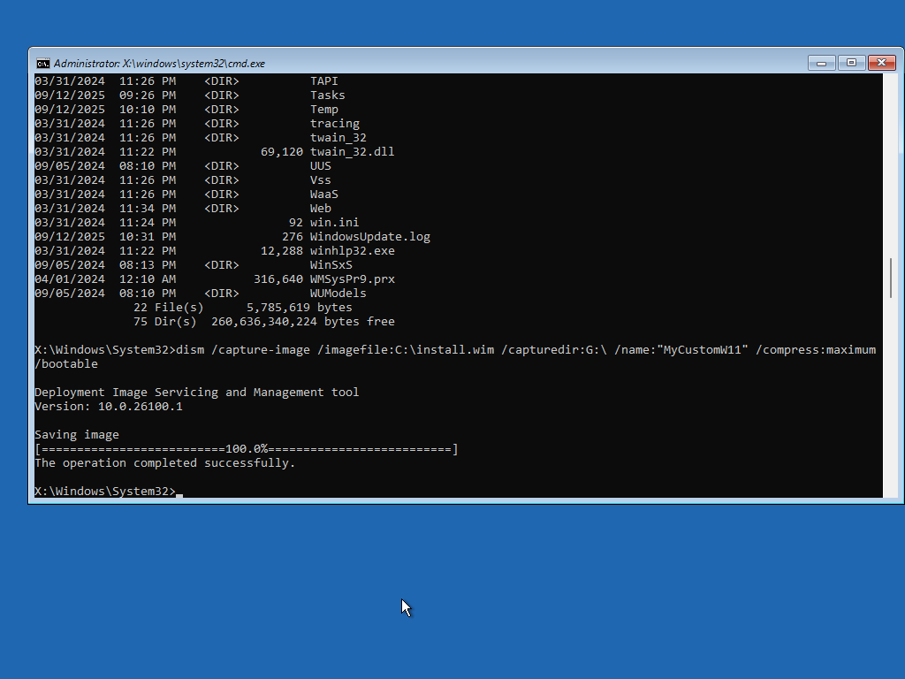

# Windows 11 LTSC Golden Image Lab

## Proof of Capture

  

## Overview
Built a custom Windows 11 LTSC golden image in VMware Workstation Pro. Applied baseline security Group Policies, generalized the system with Sysprep, and captured a deployable `install.wim` using DISM in WinPE.

## Skills Practiced
- VMware Workstation Pro
- Windows 11 LTSC deployment
- Group Policy hardening (passwords, lockout, firewall, remote registry)
- Sysprep (OOBE + Generalize)
- DISM capture and WIM management

## Results
- Produced a reusable `install.wim` containing security policies
- Verified policies via `gpresult` and post-deployment checks
- Troubleshot common Sysprep/DISM errors for a repeatable workflow

## Screenshots
See `/screenshots` folder for proof of configuration and capture.

## Documentation
- [Group Policy Report (gpresult)](gpresult-report.zip)
